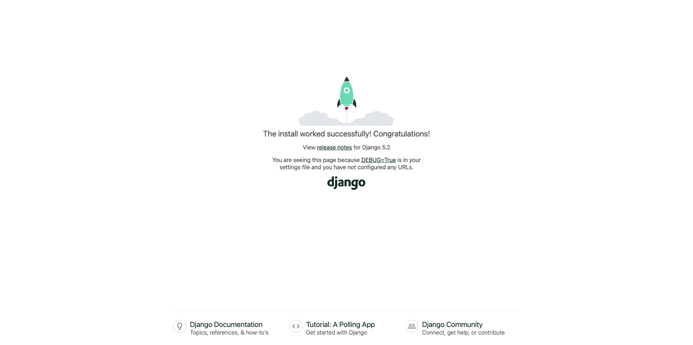

# Getting started {.unnumbered}

## Installing Django

```sh
uv venv                    
source .venv/bin/activate
uv pip install django
```

## Starting the project
```sh 
django-admin startproject learning_log .
```
Tells Django to set up a new project called `learning_log`. The dot at the end of the command creates the new project with a directory structure that will make it easy to deploy the app to a server when we’re finished developing it.

After running the command, Django has created a new directory called `learning_log`. It contains 5 files:
- `settings.py`: Contains all configuration for your Django project. You will edit this file often.
    - Installed apps
    - Middleware
    - Database settings
    - Templates
    - Allowed hosts
    - Static file configuration

- `urls.py`: Routes URLs to views. It tells Django which view function or class should handle each URL. You will edit this file often too.

- `wsgi.py`: (Old Style) Entry point for WSGI-compatible web servers (Apache, Gunicorn, uWSGI, etc.). You normally never touch this file
    - WSGI = Web Server Gateway Interface
    - Think of this like: “The way Django used to talk to the web.”
    - Web servers such as Gunicorn or Apache use this.

- `asgi.py`: (Modern Style) Entry point for ASGI-compatible servers (Uvicorn, Daphne, Hypercorn, etc). You normally never touch this file too.
    - ASGI = Asynchronous Server Gateway Interface
    - Allows Django to support:
        - WebSockets
        - Background tasks
        - Long-running connections
        - Async views
        - Modern high-performance servers

- `init.py`: This file makes the directory a Python package. You never edit this.

It also created a `manage.py` file, which is a short program that takes in commands and feeds them to the relevant part of Django to run them. We’ll use these commands to manage tasks, such as working with databases and running servers.

### Creating the database
Django stores most of the information for a project in a database, so next
we need to create a database that Django can work with. Enter the following
command (still in an active environment)
```sh
python manage.py migrate
```

After running the command, we can see that it creates a new file called `db.sqlite3` and a new folder `learning_log/__pycache__`.

### Testing our setup
Let’s make sure that Django has set up the project properly. Enter the
runserver command as follows to view the project in its current state:
```sh
python manage.py runserver
```
You can open a web browser and enter the URL http://localhost:8000/, or http://127.0.0.1:8000/ (if the first link doesn’t work).

You should see something like this:



Keep the server running for now, but when you want to stop the server,
press ctrl-C in the terminal where the runserver command was issued.

https://khwarizmi.org/wp-content/uploads/2021/04/Eric_Matthes_Python_Crash_Course_A_Hands.pdf

continue on page 420 tmrw